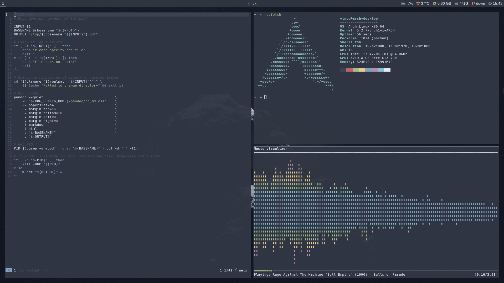

# Dotfiles


[](https://github.com/Vincevrp/dotfiles/releases)
[](https://github.com/Vincevrp/dotfiles)

[](https://github.com/Vincevrp/dotfiles/blob/master/LICENSE)

## Introduction

This repository contains the configuration files (dotfiles) for my desktop workstation, based on Arch Linux. Other branches are used for my other devices.

### Initialize

I use a bare git repository to manage my dotfiles. To initialize use the following commands:

```
git clone --bare <git-repo-url> $HOME/.dotfiles
alias dotfiles='git --git-dir=$HOME/.dotfiles --work-tree=$HOME'
dotfiles checkout
dotfiles config --local status.showUntrackedFiles no
```

If you receive an error message about untracked working tree files; run the following command:

```
mkdir -p dot-backup && \
dotfiles checkout 2>&1 | egrep "\s+\." | awk {'print $1'} | \
xargs -I{} mv {} .dot-backup/{}
```

The idea behind the method described here is based on [this](https://developer.atlassian.com/blog/2016/02/best-way-to-store-dotfiles-git-bare-repo/) article.

### Screenshots




## Contents

Listed below are the main components of my setup. This does not include everything, only the main configuration that is necessary for the core looks and functionality, and other components that need extra information.

### Window manager and terminal

#### [i3-gaps](https://www.archlinux.org/packages/community/x86_64/i3-gaps/)

I use i3-gaps as my window manager. It's a highly customizable tiling WM, refer to `.config/i3/config` for my usage and keybindings.

##### [Compton](https://github.com/chjj/compton)

Compton is used for display compositing. The configuration can be found in `.config/compton.conf`.

##### [Polybar](https://github.com/jaagr/polybar)

Polybar is the statusbar that I use for i3. Configuration files and scripts are stored in `.config/polybar`.

##### [Rofi](https://github.com/DaveDavenport/rofi)

Rofi is used as my application launcher. Theme and configuration can be found under `.config/rofi`.

#### [st (suckless terminal)](https://github.com/Vincevrp/st)

This is my custom build of st. It resides in a separate repository.

### Colors and looks

#### [Nord](https://github.com/arcticicestudio/nord)

All colors are based on

[//]: # (Inline HTML to center the image)

<div align="center">
    
</div>
<br>

I may have referenced these colors in other configuration files that are not officially supported by Nord.

#### Fonts

The following fonts are used throughout this config:

- [Hack (patched)](https://github.com/ryanoasis/nerd-fonts/tree/master/patched-fonts/Hack)
- [Arimo (patched)](https://github.com/ryanoasis/nerd-fonts/tree/master/patched-fonts/Arimo)
- [Nimbus Sans](https://github.com/ArtifexSoftware/urw-base35-fonts)

Required packages: `nerd-fonts-complete gsfonts`.

### Tools

#### [MPD](https://github.com/MusicPlayerDaemon/MPD)

Music Player Daemon is used to manage my music library.

##### [ncmpcpp](https://github.com/arybczak/ncmpcpp)

Music player for MPD, configuration resides in `.config/ncmpcpp`.

#### [Ranger](https://github.com/ranger/ranger)

Terminal file browser. Run `ranger --copy-config=all` before copying `rc.conf` to get the required default configuration.

#### [Tmux](https://github.com/tmux/tmux)

Requires [tpm](https://github.com/tmux-plugins/tpm) to be installed. Refer to the repository for usage and installation instructions.

#### [Vim](https://github.com/vim/vim)

Requires [vim-plug](https://github.com/junegunn/vim-plug) to be installed from AUR.

Extra syntax checkers:

- [JSHint](https://github.com/jshint/jshint/): Install by running `sudo npm install -g jshint`.
- [Sass-lint](https://github.com/sasstools/sass-lint): Install by running `sudo npm install -g sass-lint`.
- [YAMLlint](https://github.com/adrienverge/yamllint): Install by running `pacman -S yamllint`.

### Shell

#### [Zsh](https://wiki.archlinux.org/index.php/Zsh)

I use Zsh as my main shell. Everything in `~/.bin/` and `~/.shell/` is available in both Zsh and Bash.

##### [Zplugin](https://github.com/zdharma/zplugin)

Flexible Zsh plugin manager. Refer to the repository for usage and installation instructions.

##### [fzf](https://github.com/junegunn/fzf)

Fuzzy finder used by both Zsh and Vim. Install by running `sudo pacman -S fzf`.

## License

See [LICENSE](../LICENSE)
